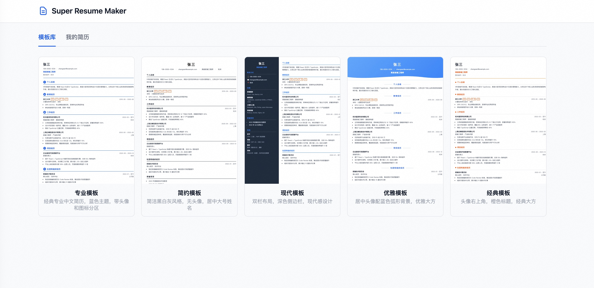

# Super Resume Maker

基于 React + Express 的 Web 端简历生成器，支持多模板切换、实时预览、PDF 导出和本地存储。

## 功能特性

- 📝 可视化编辑器：左侧表单编辑，右侧实时预览
- 🎨 多套模板：专业中文模板、简约模板、现代双栏模板
- 📄 PDF 导出：利用浏览器打印引擎，完美还原样式
- 💾 本地存储：JSON 文件存储在运行目录，支持二次编辑
- 🔄 完整 CRUD：新建、编辑、删除、列表管理

### 模板选择


### 编辑器


## 快速开始

### 安装依赖

```bash
npm install
npm run install:all
```

### 本地开发

```bash
npm run dev
```

前端访问：http://localhost:5173
后端 API：http://localhost:3001

### 构建

```bash
npm run build
```

## 部署

### 同步到远程服务器

```bash
make sync
```

### 在远程服务器启动

```bash
make start
```

## 项目结构

```
super-resume-maker/
├── client/                 # 前端 (React + Vite)
│   └── src/
│       ├── components/     # 通用组件
│       ├── pages/          # 页面（Home、Editor）
│       ├── templates/      # 简历模板
│       ├── hooks/          # 自定义 hooks
│       ├── services/       # API 服务层
│       └── types/          # TypeScript 类型
├── server/                 # 后端 (Express)
│   ├── routes/             # API 路由
│   └── utils/              # 工具函数
├── data/resumes/           # 简历 JSON 存储目录
├── Makefile                # 部署脚本
└── package.json            # 根配置
```

## 模板预览

1. **专业模板** - 经典专业中文简历，带头像，蓝色主题
2. **简约模板** - 黑白简洁风格，无头像，内容优先
3. **现代模板** - 双栏设计，深色侧边栏，现代感

## 使用说明

1. 打开首页，点击「新建简历」
2. 选择模板，输入标题
3. 在编辑器左侧填写各项信息
4. 右侧实时预览效果
5. 点击「保存」存储到本地
6. 点击「导出 PDF」生成文件
